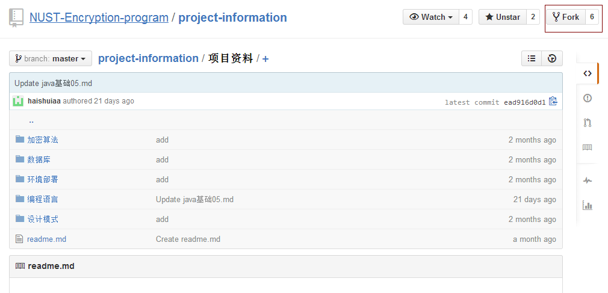

#github使用说明

##github的注册

1、打开网页[github主页]https://github.com/，如图，设定用户名，登陆密码，邮箱即可。

2、打开我们的项目主页[项目主页]https://github.com/NUST-Encryption-program/project-information/tree/master/项目资料,如图，点击fork，这样就可以在自己的repositories里发现project-information这个歌项目。

##github的使用

1、下载安装github客户端

